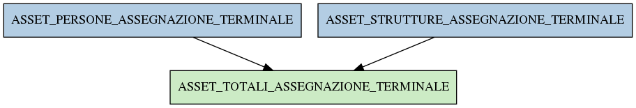

# ASSET_TOTALI_ASSEGNAZIONE_TERMINALE

## Info tabella

| Info                     | Descrizione                                                                                                                                 |
|:-------------------------|:--------------------------------------------------------------------------------------------------------------------------------------------|
| Nome tabella Dremio      | ASSET_TOTALI_ASSEGNAZIONE_TERMINALE                                                                                                         |
| Space Dremio             | fbk_test1__VISUALIZATION_TABLES                                                                                                             |
| Nome completo            | fbk_test1__VISUALIZATION_TABLES.ASSET_TOTALI_ASSEGNAZIONE_TERMINALE                                                                         |
| Descrizione tabella      |                                                                                                                                             |
| Versione                 | 1.0                                                                                                                                         |
| Core dataset             | False                                                                                                                                       |
| Dataset di origine       |                                                                                                                                             |
| Richiede validazione     | False                                                                                                                                       |
| Esposta in DSS           | True                                                                                                                                        |
| Endpoint DSS             | /asset-totali-assegnazione-terminale                                                                                                        |
| Query name DSS           | asset_totali_assegnazione_terminale                                                                                                         |
| Formato esposizione      | JSON                                                                                                                                        |
| Tipologia autenticazione | Bearer token                                                                                                                                |
| Tabelle genitrici        | [fbk_test1__MASTER_DATA.ASSET_PERSONE_ASSEGNAZIONE_TERMINALE](/fbk_test1__MASTER_DATA/ASSET_PERSONE_ASSEGNAZIONE_TERMINALE/markdown.md)     |
|                          | [fbk_test1__MASTER_DATA.ASSET_STRUTTURE_ASSEGNAZIONE_TERMINALE](/fbk_test1__MASTER_DATA/ASSET_STRUTTURE_ASSEGNAZIONE_TERMINALE/markdown.md) |
| Tabelle figlie           |                                                                                                                                             |

## Struttura relazionale

## Descrizione struttura tabella

| Campo                              | Descrizione                        | Tipo     | Constraints   | Linked data   | errors   |
|:-----------------------------------|:-----------------------------------|:---------|:--------------|:--------------|:---------|
| id_assegnazione_terminale          | Id assegnazione terminale          | integer  | {}            |               | {}       |
| data_inizio_assegnazione_terminale | Data inizio assegnazione terminale | datetime | {}            |               | {}       |
| data_fine_assegnazione_terminale   | Data fine assegnazione terminale   | datetime | {}            |               | {}       |
| terminale_is_personale             | Terminale is personale             | integer  | {}            |               | {}       |
| causale_ritiro_terminale           | Causale ritiro terminale           | string   | {}            |               | {}       |
| codice_struttura_fonia             | Codice struttura fonia             | string   | {}            |               | {}       |
| matricola_estesa                   | Matricola estesa                   | string   | {}            |               | {}       |
| matricola                          | Matricola                          | integer  | {}            |               | {}       |
| codice_fiscale                     | Codice fiscale                     | string   | {}            |               | {}       |
| descrizione_gruppo                 | Descrizione gruppo                 | string   | {}            |               | {}       |
| id_struttura                       | Id struttura                       | integer  | {}            |               | {}       |
| terminale_id                       | Terminale id                       | integer  | {}            |               | {}       |
