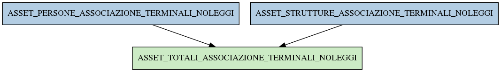

# ASSET_TOTALI_ASSOCIAZIONE_TERMINALI_NOLEGGI

## Info tabella

| Info                     | Descrizione                                                                                                                                                               |
|:-------------------------|:--------------------------------------------------------------------------------------------------------------------------------------------------------------------------|
| Nome tabella Dremio      | ASSET_TOTALI_ASSOCIAZIONE_TERMINALI_NOLEGGI                                                                                                                               |
| Space Dremio             | fbk_test1__VISUALIZATION_TABLES                                                                                                                                           |
| Nome completo            | fbk_test1__VISUALIZATION_TABLES.ASSET_TOTALI_ASSOCIAZIONE_TERMINALI_NOLEGGI                                                                                               |
| Descrizione tabella      |                                                                                                                                                                           |
| Versione                 | 1.0                                                                                                                                                                       |
| Core dataset             | False                                                                                                                                                                     |
| Dataset di origine       |                                                                                                                                                                           |
| Richiede validazione     | False                                                                                                                                                                     |
| Esposta in DSS           | True                                                                                                                                                                      |
| Endpoint DSS             |                                                                                                                                                                           |
| Query name DSS           |                                                                                                                                                                           |
| Formato esposizione      | JSON                                                                                                                                                                      |
| Tipologia autenticazione | Bearer token                                                                                                                                                              |
| Tabelle genitrici        | [fbk_test1__MASTER_DATA.ASSET_PERSONE_ASSOCIAZIONE_TERMINALI_NOLEGGI](/Documentation/fbk_test1__MASTER_DATA/ASSET_PERSONE_ASSOCIAZIONE_TERMINALI_NOLEGGI/markdown.md)     |
|                          | [fbk_test1__MASTER_DATA.ASSET_STRUTTURE_ASSOCIAZIONE_TERMINALI_NOLEGGI](/Documentation/fbk_test1__MASTER_DATA/ASSET_STRUTTURE_ASSOCIAZIONE_TERMINALI_NOLEGGI/markdown.md) |
| Tabelle figlie           |                                                                                                                                                                           |

## Struttura relazionale

## Descrizione struttura tabella

| Campo                             | Descrizione                       | Tipo    | Constraints   | Linked data   | errors   |
|:----------------------------------|:----------------------------------|:--------|:--------------|:--------------|:---------|
| terminale_id                      | Terminale id                      | integer | {}            |               | {}       |
| imei                              | Imei                              | string  | {}            |               | {}       |
| terminale_is_riscattato           | Terminale is riscattato           | integer | {}            |               | {}       |
| stato_terminale                   | Stato terminale                   | string  | {}            |               | {}       |
| canone_noleggio_terminale         | Canone noleggio terminale         | number  | {}            |               | {}       |
| durata_noleggio_terminale         | Durata noleggio terminale         | integer | {}            |               | {}       |
| descrizione_modello_terminale     | Descrizione modello terminale     | string  | {}            |               | {}       |
| descrizione_fascia_terminale      | Descrizione fascia terminale      | string  | {}            |               | {}       |
| descrizione_tipologia_terminale   | Descrizione tipologia terminale   | string  | {}            |               | {}       |
| descrizione_marca_terminale       | Descrizione marca terminale       | string  | {}            |               | {}       |
| caratteristiche_modello_terminale | Caratteristiche modello terminale | string  | {}            |               | {}       |
| peso_modello_terminale            | Peso modello terminale            | string  | {}            |               | {}       |
| contratto_id                      | Contratto id                      | integer | {}            |               | {}       |
| codice_riferimento_contratto      | Codice riferimento contratto      | string  | {}            |               | {}       |
| descrizione_contratto             | Descrizione contratto             | string  | {}            |               | {}       |
