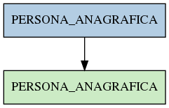

# PERSONA_ANAGRAFICA

## Info tabella

| Info                     | Descrizione                                                                                                       |
|:-------------------------|:------------------------------------------------------------------------------------------------------------------|
| Nome tabella Dremio      | PERSONA_ANAGRAFICA                                                                                                |
| Space Dremio             | fbk_test1__VISUALIZATION_TABLES                                                                                   |
| Nome completo            | fbk_test1__VISUALIZATION_TABLES.PERSONA_ANAGRAFICA                                                                |
| Descrizione tabella      |                                                                                                                   |
| Versione                 | 1.0                                                                                                               |
| Core dataset             | False                                                                                                             |
| Dataset di origine       |                                                                                                                   |
| Richiede validazione     | False                                                                                                             |
| Esposta in DSS           | True                                                                                                              |
| Endpoint DSS             | /anagrafica                                                                                                       |
| Query name DSS           | anagrafica                                                                                                        |
| Formato esposizione      | JSON                                                                                                              |
| Tipologia autenticazione | Bearer token                                                                                                      |
| Tabelle genitrici        | [fbk_test1__MASTER_DATA.PERSONA_ANAGRAFICA](/Documentation/fbk_test1__MASTER_DATA/PERSONA_ANAGRAFICA/markdown.md) |
| Tabelle figlie           |                                                                                                                   |

## Struttura relazionale

## Descrizione struttura tabella

| Campo            | Descrizione      | Tipo     | Constraints   | Linked data   | errors   |
|:-----------------|:-----------------|:---------|:--------------|:--------------|:---------|
| matricola_estesa | Matricola estesa | string   | {}            |               | {}       |
| matricola        | Matricola        | integer  | {}            |               | {}       |
| nome             | Nome             | string   | {}            |               | {}       |
| cognome          | Cognome          | string   | {}            |               | {}       |
| data_nascita     | Data nascita     | datetime | {}            |               | {}       |
| eta              | Eta              | integer  | {}            |               | {}       |
| range_eta        | Range eta        | string   | {}            |               | {}       |
| codice_fiscale   | Codice fiscale   | string   | {}            |               | {}       |
| sesso            | Sesso            | string   | {}            |               | {}       |
| codice_cittadino | Codice cittadino | integer  | {}            |               | {}       |
| provenienza      | Provenienza      | string   | {}            |               | {}       |
