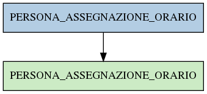

# PERSONA_ASSEGNAZIONE_ORARIO

## Info tabella

| Info                     | Descrizione                                                                                                                         |
|:-------------------------|:------------------------------------------------------------------------------------------------------------------------------------|
| Nome tabella Dremio      | PERSONA_ASSEGNAZIONE_ORARIO                                                                                                         |
| Space Dremio             | fbk_test1__VISUALIZATION_TABLES                                                                                                     |
| Nome completo            | fbk_test1__VISUALIZATION_TABLES.PERSONA_ASSEGNAZIONE_ORARIO                                                                         |
| Descrizione tabella      |                                                                                                                                     |
| Versione                 | 1.0                                                                                                                                 |
| Core dataset             | False                                                                                                                               |
| Dataset di origine       |                                                                                                                                     |
| Richiede validazione     | False                                                                                                                               |
| Esposta in DSS           | True                                                                                                                                |
| Endpoint DSS             | /assegnazione-orario                                                                                                                |
| Query name DSS           | assegnazione_orario                                                                                                                 |
| Formato esposizione      | JSON                                                                                                                                |
| Tipologia autenticazione | Bearer token                                                                                                                        |
| Tabelle genitrici        | [fbk_test1__MASTER_DATA.PERSONA_ASSEGNAZIONE_ORARIO](/Documentation/fbk_test1__MASTER_DATA/PERSONA_ASSEGNAZIONE_ORARIO/markdown.md) |
| Tabelle figlie           |                                                                                                                                     |

## Struttura relazionale

## Descrizione struttura tabella

| Campo                                 | Descrizione                           | Tipo     | Constraints   | Linked data   | errors   |
|:--------------------------------------|:--------------------------------------|:---------|:--------------|:--------------|:---------|
| matricola_estesa                      | Matricola estesa                      | string   | {}            |               | {}       |
| data_inizio_assegnazione_orario       | Data inizio assegnazione orario       | datetime | {}            |               | {}       |
| data_fine_assegnazione_orario         | Data fine assegnazione orario         | datetime | {}            |               | {}       |
| data_inserimento_assegnazione_orario  | Data inserimento assegnazione orario  | datetime | {}            |               | {}       |
| data_applicazione_assegnazione_orario | Data applicazione assegnazione orario | datetime | {}            |               | {}       |
| tipo_assegnazione_orario              | Tipo assegnazione orario              | string   | {}            |               | {}       |
| codice_orario                         | Codice orario                         | integer  | {}            |               | {}       |
| descrizione_tipo_orario               | Descrizione tipo orario               | string   | {}            |               | {}       |
