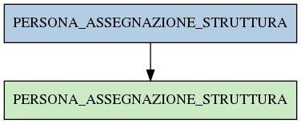

# PERSONA_ASSEGNAZIONE_STRUTTURA

## Info tabella

| Info                     | Descrizione                                                                                                                               |
|:-------------------------|:------------------------------------------------------------------------------------------------------------------------------------------|
| Nome tabella Dremio      | PERSONA_ASSEGNAZIONE_STRUTTURA                                                                                                            |
| Space Dremio             | fbk_test1__VISUALIZATION_TABLES                                                                                                           |
| Nome completo            | fbk_test1__VISUALIZATION_TABLES.PERSONA_ASSEGNAZIONE_STRUTTURA                                                                            |
| Descrizione tabella      |                                                                                                                                           |
| Versione                 | 1.0                                                                                                                                       |
| Core dataset             | False                                                                                                                                     |
| Dataset di origine       |                                                                                                                                           |
| Richiede validazione     | False                                                                                                                                     |
| Esposta in DSS           | True                                                                                                                                      |
| Endpoint DSS             | /assegnazione-struttura                                                                                                                   |
| Query name DSS           | assegnazione_struttura                                                                                                                    |
| Formato esposizione      | JSON                                                                                                                                      |
| Tipologia autenticazione | Bearer token                                                                                                                              |
| Tabelle genitrici        | [fbk_test1__MASTER_DATA.PERSONA_ASSEGNAZIONE_STRUTTURA](/Documentation/fbk_test1__MASTER_DATA/PERSONA_ASSEGNAZIONE_STRUTTURA/markdown.md) |
| Tabelle figlie           |                                                                                                                                           |

## Struttura relazionale

## Descrizione struttura tabella

| Campo                                    | Descrizione                              | Tipo     | Constraints   | Linked data   | errors   |
|:-----------------------------------------|:-----------------------------------------|:---------|:--------------|:--------------|:---------|
| matricola_estesa                         | Matricola estesa                         | string   | {}            |               | {}       |
| data_inizio_assegnazione_struttura       | Data inizio assegnazione struttura       | datetime | {}            |               | {}       |
| data_fine_assegnazione_struttura         | Data fine assegnazione struttura         | datetime | {}            |               | {}       |
| data_inserimento_assegnazione_struttura  | Data inserimento assegnazione struttura  | datetime | {}            |               | {}       |
| data_applicazione_assegnazione_struttura | Data applicazione assegnazione struttura | datetime | {}            |               | {}       |
| tipo_assegnazione_struttura              | Tipo assegnazione struttura              | string   | {}            |               | {}       |
| codice_struttura                         | Codice struttura                         | string   | {}            |               | {}       |
| id_struttura                             | Id struttura                             | integer  | {}            |               | {}       |
