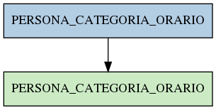

# PERSONA_CATEGORIA_ORARIO

## Info tabella

| Info                     | Descrizione                                                                                                     |
|:-------------------------|:----------------------------------------------------------------------------------------------------------------|
| Nome tabella Dremio      | PERSONA_CATEGORIA_ORARIO                                                                                        |
| Space Dremio             | fbk_test1__VISUALIZATION_TABLES                                                                                 |
| Nome completo            | fbk_test1__VISUALIZATION_TABLES.PERSONA_CATEGORIA_ORARIO                                                        |
| Descrizione tabella      |                                                                                                                 |
| Versione                 | 1.0                                                                                                             |
| Core dataset             | False                                                                                                           |
| Dataset di origine       |                                                                                                                 |
| Richiede validazione     | False                                                                                                           |
| Esposta in DSS           | True                                                                                                            |
| Endpoint DSS             | /categoria-orario                                                                                               |
| Query name DSS           | categoria_orario                                                                                                |
| Formato esposizione      | JSON                                                                                                            |
| Tipologia autenticazione | Bearer token                                                                                                    |
| Tabelle genitrici        | [fbk_test1__MASTER_DATA.PERSONA_CATEGORIA_ORARIO](/fbk_test1__MASTER_DATA/PERSONA_CATEGORIA_ORARIO/markdown.md) |
| Tabelle figlie           |                                                                                                                 |

## Struttura relazionale

## Descrizione struttura tabella

| Campo                                     | Descrizione                               | Tipo     | Constraints   | Linked data   | errors   |
|:------------------------------------------|:------------------------------------------|:---------|:--------------|:--------------|:---------|
| matricola_estesa                          | Matricola estesa                          | string   | {}            |               | {}       |
| data_inizio_assegnazione_categoria_orario | Data inizio assegnazione categoria orario | datetime | {}            |               | {}       |
| data_fine_assegnazione_categoria_orario   | Data fine assegnazione categoria orario   | datetime | {}            |               | {}       |
| data_inserimento_categoria_orario         | Data inserimento categoria orario         | datetime | {}            |               | {}       |
| data_applicazione_categoria_orario        | Data applicazione categoria orario        | datetime | {}            |               | {}       |
| tipo_assegnazione_orario                  | Tipo assegnazione orario                  | string   | {}            |               | {}       |
| codice_categoria_orario                   | Codice categoria orario                   | string   | {}            |               | {}       |
