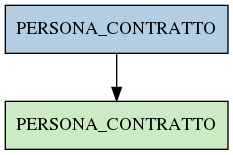

# PERSONA_CONTRATTO

## Info tabella

| Info                     | Descrizione                                                                                                     |
|:-------------------------|:----------------------------------------------------------------------------------------------------------------|
| Nome tabella Dremio      | PERSONA_CONTRATTO                                                                                               |
| Space Dremio             | fbk_test1__VISUALIZATION_TABLES                                                                                 |
| Nome completo            | fbk_test1__VISUALIZATION_TABLES.PERSONA_CONTRATTO                                                               |
| Descrizione tabella      |                                                                                                                 |
| Versione                 | 1.0                                                                                                             |
| Core dataset             | False                                                                                                           |
| Dataset di origine       |                                                                                                                 |
| Richiede validazione     | False                                                                                                           |
| Esposta in DSS           | True                                                                                                            |
| Endpoint DSS             | /rapporto                                                                                                       |
| Query name DSS           | contratto                                                                                                       |
| Formato esposizione      | JSON                                                                                                            |
| Tipologia autenticazione | Bearer token                                                                                                    |
| Tabelle genitrici        | [fbk_test1__MASTER_DATA.PERSONA_CONTRATTO](/Documentation/fbk_test1__MASTER_DATA/PERSONA_CONTRATTO/markdown.md) |
| Tabelle figlie           |                                                                                                                 |

## Struttura relazionale

## Descrizione struttura tabella

| Campo                                  | Descrizione                            | Tipo     | Constraints   | Linked data   | errors   |
|:---------------------------------------|:---------------------------------------|:---------|:--------------|:--------------|:---------|
| matricola_estesa                       | Matricola estesa                       | string   | {}            |               | {}       |
| data_inizio_rapporto                   | Data inizio rapporto                   | datetime | {}            |               | {}       |
| data_fine_rapporto                     | Data fine rapporto                     | datetime | {}            |               | {}       |
| data_inserimento_rapporto              | Data inserimento rapporto              | datetime | {}            |               | {}       |
| data_applicazione_rapporto             | Data applicazione rapporto             | datetime | {}            |               | {}       |
| tipo_rapporto                          | Tipo rapporto                          | string   | {}            |               | {}       |
| codice_area_contrattuale_rapporto      | Codice area contrattuale rapporto      | integer  | {}            |               | {}       |
| descrizione_area_contrattuale_rapporto | Descrizione area contrattuale rapporto | string   | {}            |               | {}       |
