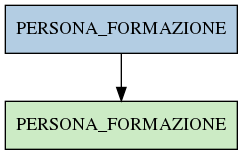

# PERSONA_FORMAZIONE

## Info tabella

| Info                     | Descrizione                                                                                                       |
|:-------------------------|:------------------------------------------------------------------------------------------------------------------|
| Nome tabella Dremio      | PERSONA_FORMAZIONE                                                                                                |
| Space Dremio             | fbk_test1__VISUALIZATION_TABLES                                                                                   |
| Nome completo            | fbk_test1__VISUALIZATION_TABLES.PERSONA_FORMAZIONE                                                                |
| Descrizione tabella      |                                                                                                                   |
| Versione                 | 1.0                                                                                                               |
| Core dataset             | False                                                                                                             |
| Dataset di origine       |                                                                                                                   |
| Richiede validazione     | False                                                                                                             |
| Esposta in DSS           | True                                                                                                              |
| Endpoint DSS             | /formazione                                                                                                       |
| Query name DSS           | formazione                                                                                                        |
| Formato esposizione      | JSON                                                                                                              |
| Tipologia autenticazione | Bearer token                                                                                                      |
| Tabelle genitrici        | [fbk_test1__MASTER_DATA.PERSONA_FORMAZIONE](/Documentation/fbk_test1__MASTER_DATA/PERSONA_FORMAZIONE/markdown.md) |
| Tabelle figlie           |                                                                                                                   |

## Struttura relazionale

## Descrizione struttura tabella

| Campo                    | Descrizione              | Tipo     | Constraints   | Linked data   | errors   |
|:-------------------------|:-------------------------|:---------|:--------------|:--------------|:---------|
| matricola_estesa         | Matricola estesa         | string   | {}            |               | {}       |
| codice_corso             | Codice corso             | string   | {}            |               | {}       |
| descrizione_corso        | Descrizione corso        | string   | {}            |               | {}       |
| ambito_formativo         | Ambito formativo         | string   | {}            |               | {}       |
| quantita_ore_corso       | Quantita ore corso       | number   | {}            |               | {}       |
| data_inizio_formazione   | Data inizio formazione   | datetime | {}            |               | {}       |
| data_fine_formazione     | Data fine formazione     | datetime | {}            |               | {}       |
| numero_crediti_corso     | Numero crediti corso     | number   | {}            |               | {}       |
| tipologia_corso          | Tipologia corso          | string   | {}            |               | {}       |
| tipologia_partecipazione | Tipologia partecipazione | string   | {}            |               | {}       |
