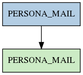

# PERSONA_MAIL

## Info tabella

| Info                     | Descrizione                                                                                           |
|:-------------------------|:------------------------------------------------------------------------------------------------------|
| Nome tabella Dremio      | PERSONA_MAIL                                                                                          |
| Space Dremio             | fbk_test1__VISUALIZATION_TABLES                                                                       |
| Nome completo            | fbk_test1__VISUALIZATION_TABLES.PERSONA_MAIL                                                          |
| Descrizione tabella      |                                                                                                       |
| Versione                 | 1.0                                                                                                   |
| Core dataset             | False                                                                                                 |
| Dataset di origine       |                                                                                                       |
| Richiede validazione     | False                                                                                                 |
| Esposta in DSS           | True                                                                                                  |
| Endpoint DSS             | /mail                                                                                                 |
| Query name DSS           | mail                                                                                                  |
| Formato esposizione      | JSON                                                                                                  |
| Tipologia autenticazione | Bearer token                                                                                          |
| Tabelle genitrici        | [fbk_test1__MASTER_DATA.PERSONA_MAIL](/Documentation/fbk_test1__MASTER_DATA/PERSONA_MAIL/markdown.md) |
| Tabelle figlie           |                                                                                                       |

## Struttura relazionale

## Descrizione struttura tabella

| Campo                      | Descrizione                | Tipo     | Constraints   | Linked data   | errors   |
|:---------------------------|:---------------------------|:---------|:--------------|:--------------|:---------|
| matricola_estesa           | Matricola estesa           | string   | {}            |               | {}       |
| data_inizio_validita_mail  | Data inizio validita mail  | datetime | {}            |               | {}       |
| data_fine_validita_mail    | Data fine validita mail    | datetime | {}            |               | {}       |
| mail_istituzionale         | Mail istituzionale         | string   | {}            |               | {}       |
| codice_stato_mail          | Codice stato mail          | string   | {}            |               | {}       |
| descrizione_stato_mail     | Descrizione stato mail     | string   | {}            |               | {}       |
| codice_tipologia_mail      | Codice tipologia mail      | string   | {}            |               | {}       |
| descrizione_tipologia_mail | Descrizione tipologia mail | string   | {}            |               | {}       |
| indicatore_backup_mail     | Indicatore backup mail     | integer  | {}            |               | {}       |
| scelta_invio_comunicazioni | Scelta invio comunicazioni | integer  | {}            |               | {}       |
