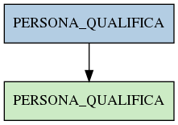

# PERSONA_QUALIFICA

## Info tabella

| Info                     | Descrizione                                                                                       |
|:-------------------------|:--------------------------------------------------------------------------------------------------|
| Nome tabella Dremio      | PERSONA_QUALIFICA                                                                                 |
| Space Dremio             | fbk_test1__VISUALIZATION_TABLES                                                                   |
| Nome completo            | fbk_test1__VISUALIZATION_TABLES.PERSONA_QUALIFICA                                                 |
| Descrizione tabella      |                                                                                                   |
| Versione                 | 1.0                                                                                               |
| Core dataset             | False                                                                                             |
| Dataset di origine       |                                                                                                   |
| Richiede validazione     | False                                                                                             |
| Esposta in DSS           | True                                                                                              |
| Endpoint DSS             | /qualifica                                                                                        |
| Query name DSS           | qualifica                                                                                         |
| Formato esposizione      | JSON                                                                                              |
| Tipologia autenticazione | Bearer token                                                                                      |
| Tabelle genitrici        | [fbk_test1__MASTER_DATA.PERSONA_QUALIFICA](/fbk_test1__MASTER_DATA/PERSONA_QUALIFICA/markdown.md) |
| Tabelle figlie           |                                                                                                   |

## Struttura relazionale

## Descrizione struttura tabella

| Campo                         | Descrizione                   | Tipo     | Constraints   | Linked data   | errors   |
|:------------------------------|:------------------------------|:---------|:--------------|:--------------|:---------|
| matricola_estesa              | Matricola estesa              | string   | {}            |               | {}       |
| data_inizio_qualifica         | Data inizio qualifica         | datetime | {}            |               | {}       |
| data_fine_qualifica           | Data fine qualifica           | datetime | {}            |               | {}       |
| data_inserimento_qualifica    | Data inserimento qualifica    | datetime | {}            |               | {}       |
| data_applicazione_qualifica   | Data applicazione qualifica   | datetime | {}            |               | {}       |
| codice_qualifica              | Codice qualifica              | string   | {}            |               | {}       |
| descrizione_qualifica         | Descrizione qualifica         | string   | {}            |               | {}       |
| codice_livello_giuridico      | Codice livello giuridico      | string   | {}            |               | {}       |
| descrizione_livello_giuridico | Descrizione livello giuridico | string   | {}            |               | {}       |
