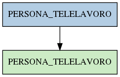

# PERSONA_TELELAVORO

## Info tabella

| Info                     | Descrizione                                                                                         |
|:-------------------------|:----------------------------------------------------------------------------------------------------|
| Nome tabella Dremio      | PERSONA_TELELAVORO                                                                                  |
| Space Dremio             | fbk_test1__VISUALIZATION_TABLES                                                                     |
| Nome completo            | fbk_test1__VISUALIZATION_TABLES.PERSONA_TELELAVORO                                                  |
| Descrizione tabella      |                                                                                                     |
| Versione                 | 1.0                                                                                                 |
| Core dataset             | False                                                                                               |
| Dataset di origine       |                                                                                                     |
| Richiede validazione     | False                                                                                               |
| Esposta in DSS           | True                                                                                                |
| Endpoint DSS             | /telelavoro                                                                                         |
| Query name DSS           | telelavoro                                                                                          |
| Formato esposizione      | JSON                                                                                                |
| Tipologia autenticazione | Bearer token                                                                                        |
| Tabelle genitrici        | [fbk_test1__MASTER_DATA.PERSONA_TELELAVORO](/fbk_test1__MASTER_DATA/PERSONA_TELELAVORO/markdown.md) |
| Tabelle figlie           |                                                                                                     |

## Struttura relazionale

## Descrizione struttura tabella

| Campo                        | Descrizione                  | Tipo     | Constraints   | Linked data   | errors   |
|:-----------------------------|:-----------------------------|:---------|:--------------|:--------------|:---------|
| matricola_estesa             | Matricola estesa             | string   | {}            |               | {}       |
| data_inizio_telelavoro       | Data inizio telelavoro       | datetime | {}            |               | {}       |
| data_fine_telelavoro         | Data fine telelavoro         | datetime | {}            |               | {}       |
| data_inserimento_telelavoro  | Data inserimento telelavoro  | datetime | {}            |               | {}       |
| data_applicazione_telelavoro | Data applicazione telelavoro | datetime | {}            |               | {}       |
| tipo_telelavoro              | Tipo telelavoro              | string   | {}            |               | {}       |
| descrizione_telelavoro       | Descrizione telelavoro       | string   | {}            |               | {}       |
