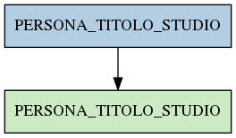

# PERSONA_TITOLO_STUDIO

## Info tabella

| Info                     | Descrizione                                                                                               |
|:-------------------------|:----------------------------------------------------------------------------------------------------------|
| Nome tabella Dremio      | PERSONA_TITOLO_STUDIO                                                                                     |
| Space Dremio             | fbk_test1__VISUALIZATION_TABLES                                                                           |
| Nome completo            | fbk_test1__VISUALIZATION_TABLES.PERSONA_TITOLO_STUDIO                                                     |
| Descrizione tabella      |                                                                                                           |
| Versione                 | 1.0                                                                                                       |
| Core dataset             | False                                                                                                     |
| Dataset di origine       |                                                                                                           |
| Richiede validazione     | False                                                                                                     |
| Esposta in DSS           | True                                                                                                      |
| Endpoint DSS             | /titolo-studio                                                                                            |
| Query name DSS           | titolo_studio                                                                                             |
| Formato esposizione      | JSON                                                                                                      |
| Tipologia autenticazione | Bearer token                                                                                              |
| Tabelle genitrici        | [fbk_test1__MASTER_DATA.PERSONA_TITOLO_STUDIO](/fbk_test1__MASTER_DATA/PERSONA_TITOLO_STUDIO/markdown.md) |
| Tabelle figlie           |                                                                                                           |

## Struttura relazionale

## Descrizione struttura tabella

| Campo                     | Descrizione               | Tipo     | Constraints   | Linked data   | errors   |
|:--------------------------|:--------------------------|:---------|:--------------|:--------------|:---------|
| matricola_estesa          | Matricola estesa          | string   | {}            |               | {}       |
| data_inizio_titolo_studio | Data inizio titolo studio | datetime | {}            |               | {}       |
| codice_titolo_studio      | Codice titolo studio      | string   | {}            |               | {}       |
| descrizione_titolo_studio | Descrizione titolo studio | string   | {}            |               | {}       |
