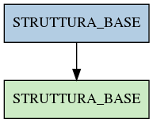

# STRUTTURA_BASE

## Info tabella

| Info                     | Descrizione                                                                                 |
|:-------------------------|:--------------------------------------------------------------------------------------------|
| Nome tabella Dremio      | STRUTTURA_BASE                                                                              |
| Space Dremio             | fbk_test1__VISUALIZATION_TABLES                                                             |
| Nome completo            | fbk_test1__VISUALIZATION_TABLES.STRUTTURA_BASE                                              |
| Descrizione tabella      |                                                                                             |
| Versione                 | 1.0                                                                                         |
| Core dataset             | False                                                                                       |
| Dataset di origine       |                                                                                             |
| Richiede validazione     | False                                                                                       |
| Esposta in DSS           | True                                                                                        |
| Endpoint DSS             | /organigramma                                                                               |
| Query name DSS           | strutture_base                                                                              |
| Formato esposizione      | JSON                                                                                        |
| Tipologia autenticazione | Bearer token                                                                                |
| Tabelle genitrici        | [fbk_test1__MASTER_DATA.STRUTTURA_BASE](/fbk_test1__MASTER_DATA/STRUTTURA_BASE/markdown.md) |
| Tabelle figlie           |                                                                                             |

## Struttura relazionale

## Descrizione struttura tabella

| Campo                 | Descrizione           | Tipo     | Constraints   | Linked data   | errors   |
|:----------------------|:----------------------|:---------|:--------------|:--------------|:---------|
| codice_struttura      | Codice struttura      | string   | {}            |               | {}       |
| tipo_struttura        | Tipo struttura        | string   | {}            |               | {}       |
| descrizione_struttura | Descrizione struttura | string   | {}            |               | {}       |
| livello_struttura     | Livello struttura     | integer  | {}            |               | {}       |
| data_inizio_struttura | Data inizio struttura | datetime | {}            |               | {}       |
| data_fine_struttura   | Data fine struttura   | datetime | {}            |               | {}       |
| id_struttura          | Id struttura          | integer  | {}            |               | {}       |
