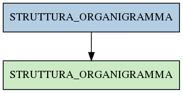

# STRUTTURA_ORGANIGRAMMA

## Info tabella

| Info                     | Descrizione                                                                                                               |
|:-------------------------|:--------------------------------------------------------------------------------------------------------------------------|
| Nome tabella Dremio      | STRUTTURA_ORGANIGRAMMA                                                                                                    |
| Space Dremio             | fbk_test1__VISUALIZATION_TABLES                                                                                           |
| Nome completo            | fbk_test1__VISUALIZATION_TABLES.STRUTTURA_ORGANIGRAMMA                                                                    |
| Descrizione tabella      |                                                                                                                           |
| Versione                 | 1.0                                                                                                                       |
| Core dataset             | False                                                                                                                     |
| Dataset di origine       |                                                                                                                           |
| Richiede validazione     | False                                                                                                                     |
| Esposta in DSS           | True                                                                                                                      |
| Endpoint DSS             | /gerarchia                                                                                                                |
| Query name DSS           | strutture_gerarchia                                                                                                       |
| Formato esposizione      | JSON                                                                                                                      |
| Tipologia autenticazione | Bearer token                                                                                                              |
| Tabelle genitrici        | [fbk_test1__MASTER_DATA.STRUTTURA_ORGANIGRAMMA](/Documentation/fbk_test1__MASTER_DATA/STRUTTURA_ORGANIGRAMMA/markdown.md) |
| Tabelle figlie           |                                                                                                                           |

## Struttura relazionale

## Descrizione struttura tabella

| Campo                           | Descrizione                     | Tipo     | Constraints   | Linked data   | errors   |
|:--------------------------------|:--------------------------------|:---------|:--------------|:--------------|:---------|
| data_inizio_gerarchia           | Data inizio gerarchia           | datetime | {}            |               | {}       |
| data_fine_gerarchia             | Data fine gerarchia             | datetime | {}            |               | {}       |
| tipo_struttura_superiore        | Tipo struttura superiore        | string   | {}            |               | {}       |
| codice_struttura_superiore      | Codice struttura superiore      | string   | {}            |               | {}       |
| descrizione_struttura_superiore | Descrizione struttura superiore | string   | {}            |               | {}       |
| livello_struttura_superiore     | Livello struttura superiore     | integer  | {}            |               | {}       |
| id_struttura                    | Id struttura                    | integer  | {}            |               | {}       |
