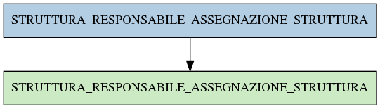

# STRUTTURA_RESPONSABILE_ASSEGNAZIONE_STRUTTURA

## Info tabella

| Info                     | Descrizione                                                                                                                                               |
|:-------------------------|:----------------------------------------------------------------------------------------------------------------------------------------------------------|
| Nome tabella Dremio      | STRUTTURA_RESPONSABILE_ASSEGNAZIONE_STRUTTURA                                                                                                             |
| Space Dremio             | fbk_test1__VISUALIZATION_TABLES                                                                                                                           |
| Nome completo            | fbk_test1__VISUALIZATION_TABLES.STRUTTURA_RESPONSABILE_ASSEGNAZIONE_STRUTTURA                                                                             |
| Descrizione tabella      |                                                                                                                                                           |
| Versione                 | 1.0                                                                                                                                                       |
| Core dataset             | False                                                                                                                                                     |
| Dataset di origine       |                                                                                                                                                           |
| Richiede validazione     | False                                                                                                                                                     |
| Esposta in DSS           | True                                                                                                                                                      |
| Endpoint DSS             |                                                                                                                                                           |
| Query name DSS           |                                                                                                                                                           |
| Formato esposizione      | JSON                                                                                                                                                      |
| Tipologia autenticazione | Bearer token                                                                                                                                              |
| Tabelle genitrici        | [fbk_test1__MASTER_DATA.STRUTTURA_RESPONSABILE_ASSEGNAZIONE_STRUTTURA](/fbk_test1__MASTER_DATA/STRUTTURA_RESPONSABILE_ASSEGNAZIONE_STRUTTURA/markdown.md) |
| Tabelle figlie           |                                                                                                                                                           |

## Struttura relazionale

## Descrizione struttura tabella

| Campo                    | Descrizione              | Tipo     | Constraints   | Linked data   | errors   |
|:-------------------------|:-------------------------|:---------|:--------------|:--------------|:---------|
| codice_struttura         | Codice struttura         | string   | {}            |               | {}       |
| incarico_funzionale      | Incarico funzionale      | string   | {}            |               | {}       |
| data_inizio_responsabile | Data inizio responsabile | datetime | {}            |               | {}       |
| data_fine_responsabile   | Data fine responsabile   | datetime | {}            |               | {}       |
| matricola_estesa         | Matricola estesa         | string   | {}            |               | {}       |
| id_struttura             | Id struttura             | integer  | {}            |               | {}       |
